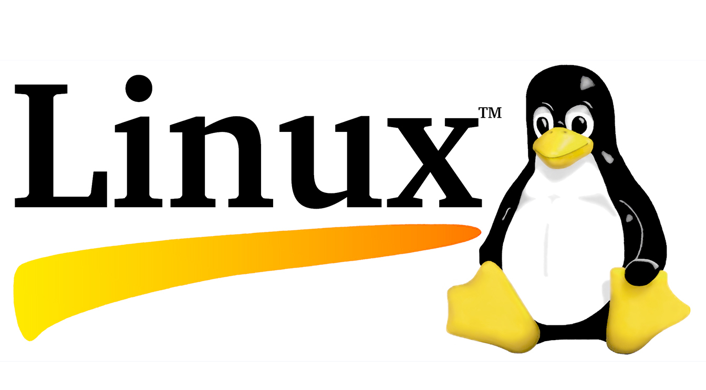
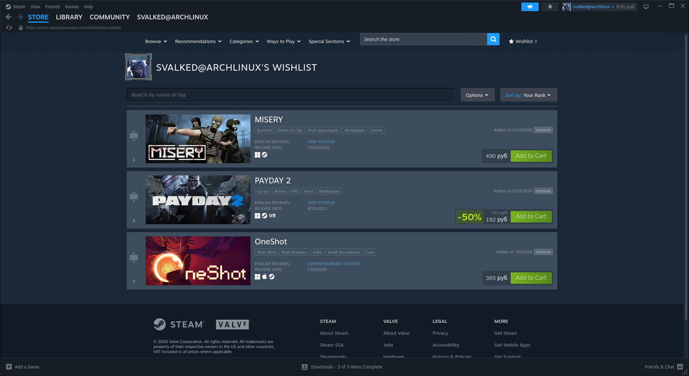

# 👋 Hey, I'm svalked

  

I'm a hobby developer from Belarus who enjoys building software for Linux.

I like writing programs that are small, fast, simple and useful. Most of my projects are command-line utilities, experiments or tools that help me learn something new.

I don't chase trends or try to make everything "enterprise". I write software because I enjoy the process and because every project teaches me something.

## 🐧 Operating System

  

Linux is my primary and only development platform.

I write, build and test my software on Linux.

I don't develop for Windows and I don't plan to support it. If someone wants to port one of my projects, they're free to do so, but Windows-specific issues and feature requests are outside the scope of my projects.

## 💻 Languages

Currently learning and using:

- 🐍 Python
- ⚙️ C++
- 🐚 Bash

I'm especially interested in low-level programming, command-line applications and understanding how software works under the hood.

## 📚 What I'm learning

Right now I'm focusing on improving my C++ skills.

Instead of solving random exercises, I prefer learning by building real applications. Even if they're small, I like finishing projects and making them actually usable.

Things I enjoy learning:

- 📦 File formats
- 🗂 CLI applications
- ⚙️ Linux APIs
- 🧠 Algorithms
- 💾 Binary files
- 🔧 System programming
- 🚀 Performance optimization

## 🎯 Philosophy

I like software that is:

- Simple
- Readable
- Lightweight
- Fast
- Useful

I prefer understanding how things work instead of relying on huge frameworks for everything.

## 🌴 About my projects

Most of my repositories are personal projects.

Some exist because I wanted a specific tool.

Some exist because I wanted to learn a technology.

Some exist simply because I thought they would be fun to build.

Not every project is meant to become a large application, and that's completely fine.

## ❤️ Open Source

I enjoy sharing my code.

Feel free to read it, learn from it or fork it.

Bug reports and suggestions are always welcome as long as they fit the goals of the project.

## ☕ Outside programming

When I'm not coding, I'm usually:

- 📖 Reading documentation
- 🐧 Exploring Linux
- ⚡ Trying new tools
- 🛠 Improving old projects
- 🎵 Listening to music while coding (Eminem/Linkin Park)

## 📫 Thanks for visiting!
Support Me!:https://steamcommunity.com/tradeoffer/new/?partner=1829486540&token=Df_lSIGx
My Wishlist: ThinkPad (any), games: payday and oneshot, rx 6800, My own server

  

If one of my projects helps you, that's awesome.

Have a nice day and happy coding! 🌴

